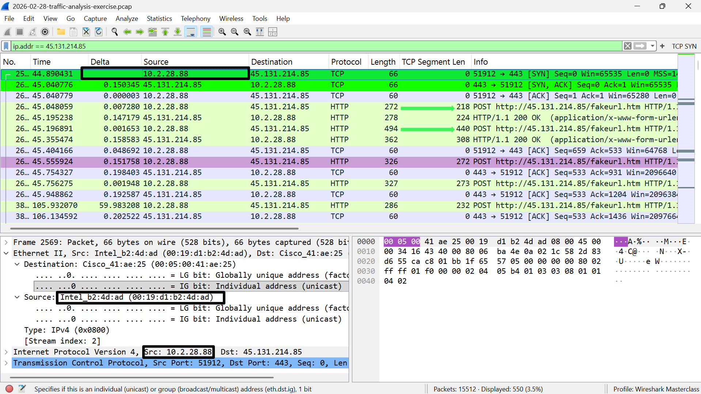
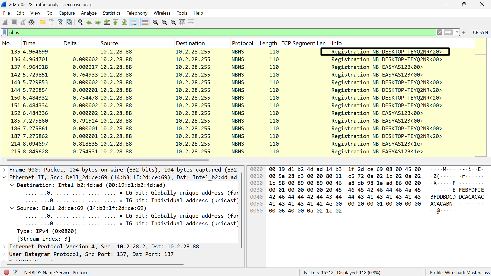
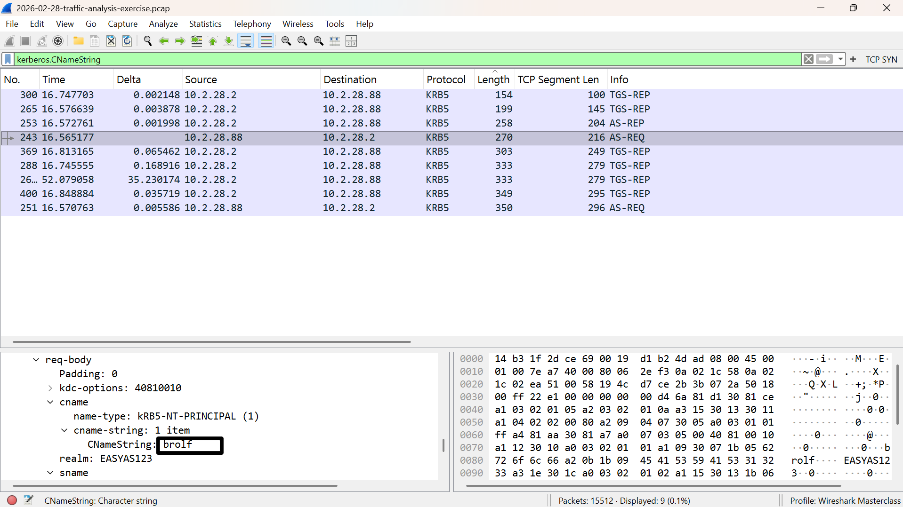
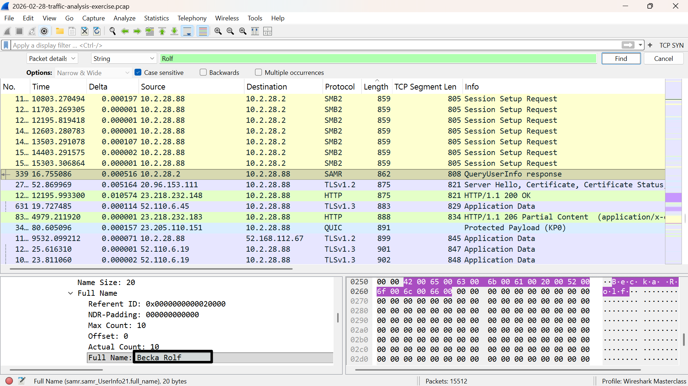

# 🔴 NetSupport Manager RAT — Traffic Analysis

**Date:** 2026-02-28
**Source:** [malware-traffic-analysis.net](https://www.malware-traffic-analysis.net/2026/02/28/index.html)
**Difficulty:** Beginner
**Status:** ✅ Complete

---

## 🏢 Environment

| Field | Value |
|---|---|
| LAN Segment Range | `10.2.28.0/24` |
| Domain | `easyas123.tech` |
| AD Environment | `EASYAS123` |
| Domain Controller | `10.2.28.2` — EASYAS123-DC |
| Gateway | `10.2.28.1` |
| Broadcast | `10.2.28.255` |

---

## 🚨 Scenario

As a SOC analyst, the SIEM flagged several signature hits for **NetSupport Manager RAT** communicating with external IP `45.131.214.85` over **TCP port 443**. Activity began on **2026-02-28 at 19:55 UTC**.

A PCAP was retrieved from the internal host triggering the alerts. The goal: identify the infected machine and produce an incident report.

---

## 🔍 Investigation Methodology

### Step 1 — Identify the infected host & MAC address

**Filter used:**
```
ip.addr == 45.131.214.85
```

**Finding:** Internal IP `10.2.28.88` was the only host communicating with the attacker's C2 (Command & Control) server. The TCP handshake (SYN → SYN-ACK → ACK) was followed immediately by repeated HTTP POST requests to `http://45.131.214.85/fakeurl.htm` — a classic RAT beacon pattern firing approximately every 60 seconds. The MAC address was retrieved by expanding the Ethernet II layer on the first SYN packet.

[](screenshots/01-infected-host-handshake-beacon-mac.PNG)

---

### Step 2 — Retrieve hostname

**Filter used:**
```
nbns
```

**Finding:** The infected machine was broadcasting its NetBIOS name to the subnet (`10.2.28.255`):
```
Registration NB DESKTOP-TEYQ2NR
```

[](screenshots/02-nbns-hostname.PNG)

---

### Step 3 — Retrieve Windows user account name

**Filter used:**
```
kerberos.CNameString
```

**Finding:** Expanded `cname → cname-string` in the Kerberos packet detail pane:
```
CNameString: brolf
```

[](screenshots/03-kerberos-username.PNG)

---

### Step 4 — Retrieve full name of user

**Method:** Edit → Find Packet → **Packet details** → String → **Case sensitive** → searched `Rolf`

**Finding:** Located in a SAMR `QueryUserInfo` response from the domain controller:
```
Full Name: Becka Rolf
```

[](screenshots/04-fullname.PNG)

---

## 📋 Incident Report

| Field | Value |
|---|---|
| **Infected IP** | `10.2.28.88` |
| **MAC Address** | `00:19:d1:b2:4d:ad` |
| **Hostname** | `DESKTOP-TEYQ2NR` |
| **User Account** | `brolf` |
| **Full Name** | `Becka Rolf` |
| **Malware** | NetSupport Manager RAT |
| **C2 Server** | `45.131.214.85:443` |
| **C2 Endpoint** | `http://45.131.214.85/fakeurl.htm` |
| **Protocol** | HTTP over TCP port 443 |
| **Beacon Interval** | ~60 seconds |
| **Activity Start** | 2026-02-28 at 19:55 UTC |

---

## 🧠 Key Lessons Learned

- **Beacon detection:** Regular, clock-like POST requests to the same external IP at ~60 second intervals is a primary IOC for RAT activity. No human behaves this mechanically — SIEMs flag this pattern automatically.
- **`fakeurl.htm`:** The attacker literally named their C2 endpoint `fakeurl.htm`. Always check the URI in HTTP POST traffic — legitimate software rarely POSTs to suspicious-looking endpoints.
- **Protocol mismatch:** The RAT used plain HTTP over TCP port 443 — not HTTPS. Unencrypted traffic on a port expected to carry TLS is itself a red flag.
- **Find Packet modes:** Wireshark's Find Packet has three modes — Packet bytes, Packet details, and Display filter. The full name was only discoverable via **Packet details** search.
- **SAMR protocol:** Full user account details including display names are transmitted via the Security Account Manager Remote (SAMR) protocol when Windows queries Active Directory.

---

## 🛠 Tools Used
- Wireshark (TCP SYN profile)
- malware-traffic-analysis.net PCAP